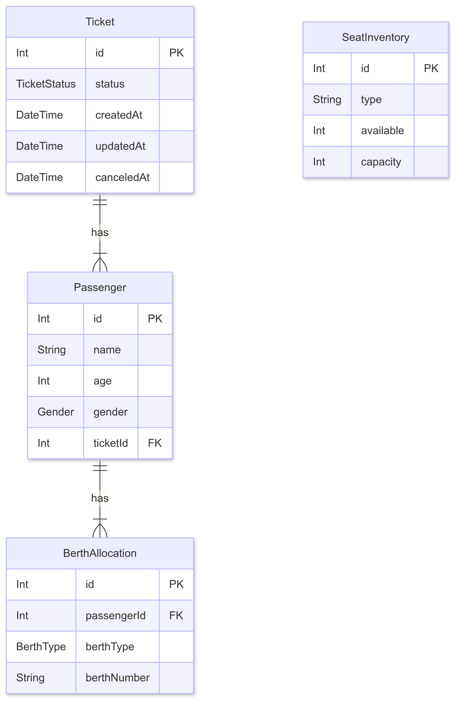

# Railway Ticket Reservation API

This is a RESTful API for managing railway ticket reservations, built with Node.js, Express, TypeScript, and PostgreSQL. It handles ticket booking, cancellation, and viewing of booked and available tickets, with a focus on correct business logic for seat allocation (Confirmed, RAC, Waiting List) and concurrency handling.

## Features

- **Book a Ticket**: Allows users to book tickets for one or more passengers.
- **Cancel a Ticket**: Enables cancellation of a confirmed ticket.
- **View Booked Tickets**: Retrieves a list of all booked tickets with passenger details.
- **View Available Tickets**: Shows the number of available tickets in each category (Lower, Middle, Upper, RAC, Waiting).
- **Priority for Lower Berths**: Passengers aged 60+ and ladies with children are given priority for lower berths.
- **RAC and Waiting List**: Manages RAC (Reservation Against Cancellation) and Waiting List tickets.
- **Concurrency Handling**: Prevents race conditions when booking tickets.

## Tech Stack

- **Backend**: Node.js, Express.js, TypeScript
- **Database**: PostgreSQL
- **ORM**: Prisma
- **Validation**: Zod
- **Containerization**: Docker

## API Endpoints

| Method | Endpoint                            | Description                       |
| ------ | ----------------------------------- | --------------------------------- |
| `POST` | `/api/v1/tickets/book`              | Book a new ticket                 |
| `POST` | `/api/v1/tickets/cancel/{ticketId}` | Cancel an existing ticket         |
| `GET`  | `/api/v1/tickets/booked`            | Get details of all booked tickets |
| `GET`  | `/api/v1/tickets/available`         | Get availability of tickets       |

## Getting Started

### Prerequisites

- Docker and Docker Compose installed on your local machine.

### Installation & Running the app

1.  **Build and run the application using Docker Compose:**

    ```bash
    docker-compose up --build
    ```

The application will be available at `http://localhost:3000`.

## Database Schema

The database schema consists of four tables: `Ticket`, `Passenger`, `BerthAllocation`, and `SeatInventory`.

- **Ticket**: Stores information about each ticket, including its status (Confirmed, RAC, Waiting, Cancelled).
- **Passenger**: Holds details of each passenger, such as name, age, and gender.
- **BerthAllocation**: Manages the allocation of berths to passengers.
- **SeatInventory**: Keeps track of the number of available seats in each category.

### ER Diagram



## Environment Variables

The following environment variables are used in this project:

| Variable       | Description                                        | Default                                                    |
| -------------- | -------------------------------------------------- | ---------------------------------------------------------- |
| `DATABASE_URL` | The connection string for the PostgreSQL database. | `postgresql://user:password@db:5432/railway?schema=public` |
| `PORT`         | The port on which the application will run.        | `3000`                                                     |

These variables are defined in the `docker-compose.yml` file.

## Project Structure

```
.
|-- prisma
|   |-- migrations
|   |   `-- 20250523113105_init
|   |       `-- migration.sql
|   |-- seed.ts
|   `-- schema.prisma
|-- src
|   |-- config
|   |   `-- prisma.ts
|   |-- controllers
|   |   `-- ticketController.controller.ts
|   |-- middleware
|   |   |-- errorHandler.ts
|   |   `-- validate.ts
|   |-- routes
|   |   `-- ticketRoutes.route.ts
|   |-- services
|   |   |-- bookTicket.service.ts
|   |   |-- cancelTicket.service.ts
|   |   |-- getAvailability.service.ts
|   |   |-- getBookedTickets.service.ts
|   |   |-- helper.ts
|   |   `-- index.ts
|   |-- validations
|   |   `-- ticket.validation.ts
|   |-- app.ts
|   `-- type.ts
|-- .gitignore
|-- docker-compose.yml
|-- Dockerfile
|-- package.json
|-- README.md
`-- tsconfig.json
```

## API Usage

### Book a Ticket

**Request:** `POST /api/v1/tickets/book`

**Body:**

```json
{
  "passengers": [
    {
      "name": "John Doe",
      "age": 30,
      "gender": "MALE"
    }
  ]
}
```

### Cancel a Ticket

**Request:** `POST /api/v1/tickets/cancel/1`

### Get Booked Tickets

**Request:** `GET /api/v1/tickets/booked`

### Get Available Tickets

**Request:** `GET /api/v1/tickets/available`
